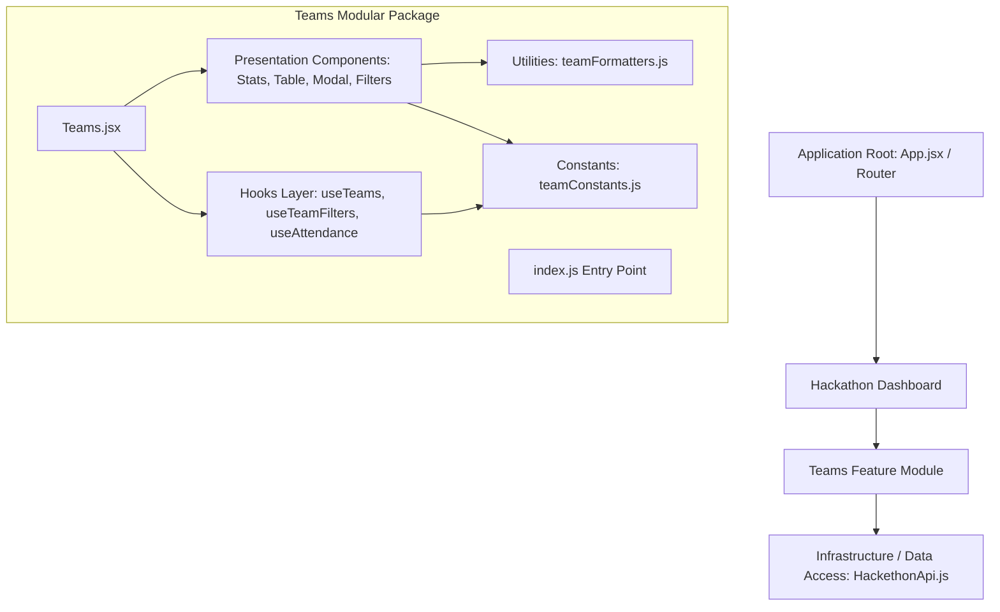

# Architecture Overview: Modular Monolith

## 1. Architectural Vision
The application is structured as a **Modular Monolith** where business domains operate as self-contained feature packages with high cohesion and loose coupling.

## 2. Teams Module Decomposition

The monolithic `Teams.jsx` (~1,316 lines) has been successfully refactored into a modular sub-system:

### 2.1 Public Entry Point
- [`teams/index.js`](file:///c:/Users/allav/Desktop/tx-p/TX/src/modules/marketing/presentation/pages/HackathonDashboard/teams/index.js): Clean public interface exposing the main `Teams` component, custom hooks (`useTeams`, `useTeamFilters`, `useAttendance`), pure formatters, and constants.

### 2.2 Component Orchestration
- [`teams/Teams.jsx`](file:///c:/Users/allav/Desktop/tx-p/TX/src/modules/marketing/presentation/pages/HackathonDashboard/teams/Teams.jsx): Thin composition layer (~75 lines) wiring state from dedicated custom hooks to presentational components.

### 2.3 Presentation Layer (`components/`)
- **TeamsHeader.jsx**: Header section with title and manual data refresh action.
- **TeamStats.jsx**: Summary statistics cards (Total, Present, Absent, Pending) with click-to-filter capability.
- **TeamSearchFilters.jsx**: Search input and quick-filter button group.
- **TeamsTable.jsx**: Data table container and table column definitions.
- **TeamTableRow.jsx**: Individual row renderer with status badges and attendance action buttons.
- **TeamDetailsModal.jsx**: Modal dialog providing comprehensive team details and verification actions.
- **TeamsLoading.jsx**: Dedicated loading state view with animated spinner.
- **TeamsError.jsx**: Error boundary/state view with retry trigger.
- **TeamsEmptyState.jsx**: Contextual empty state handling (search-filtered vs no data).
- **TeamsNotification.jsx**: Dismissible/timed status notification banner.

### 2.4 Domain Logic & Hooks Layer (`hooks/`)
- **useTeams.js**: Manages data fetching lifecycle from Google Sheets, error state, and subscriptions to window `registrationUpdated` events.
- **useTeamFilters.js**: Manages search queries, active category filters, client-side filtering predicate, and counts computation.
- **useAttendance.js**: Coordinates updating attendance records, tracking active saving ID, issuing user notifications with auto-timeout, and dispatching `attendanceUpdated` events.

### 2.5 Utilities & Constants (`utils/` & `constants/`)
- **teamFormatters.js**: Pure extraction of team lead name normalization and member count computation (JSON parsing, regex matching, fallback handling).
- **teamConstants.js**: Centralized definitions of filter constants, attendance statuses, verification flags, and custom browser events.
